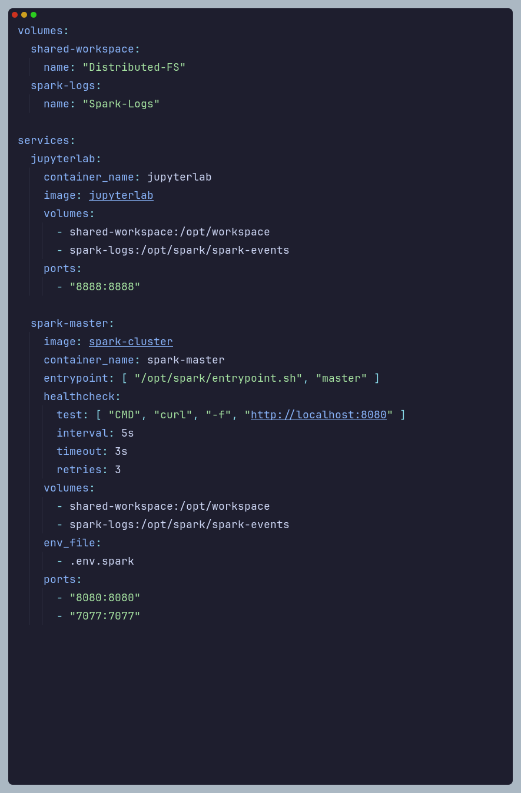

# BigBanyanTree
BigBanyanTree is an initiative to empower engineering colleges to set up their data engineering clusters and drive interest in data processing and analysis using tools such as Apache Spark.

This project was made in collaboration with  under the guidance of .

The endeavour comprised of 3 main steps:
- Set up a ***dedicated Apache Spark cluster*** along with Jupyterlab interface to run Spark jobs.
- Parse a ***random 1% sample of the Common Crawl data dumps*** spanning the years 2018 to 2024, extracting various attributes.
- Perform **various analyses on the extracted datasets** and open-source our findings. 

Check out the open-sourced HuggingFace datasets we created at [huggingface.co/big-banyan-tree](https://huggingface.co/big-banyan-tree)     
    

### Apache Cluster Setup
We first set up an Apache Spark cluster in standalone mode on a dedicated Hetzner server. The entire server setup was made quite simple and straightforward by making use of `Docker` and `Docker Compose`.

Here is the `docker-compose` config we used for the `spark-master` and `jupyterlab` :   

   

 

To get a more in-depth understanding of our Apache Spark cluster setup, check out the following resources :
- [GitHub](https://github.com/GR-Menon/Spark-Bazaar)
- [Setup Blog](https://datascience.fm/zero-to-spark-apache-spark-cluster-setup/)
- [LLM Service Setup](https://datascience.fm/llamafile-an-executable-llm/)

### CommonCrawl Data Processing
TODO

